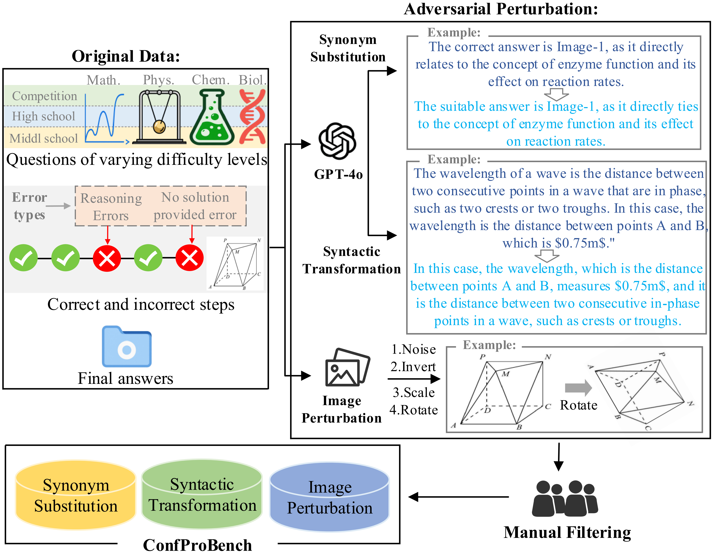
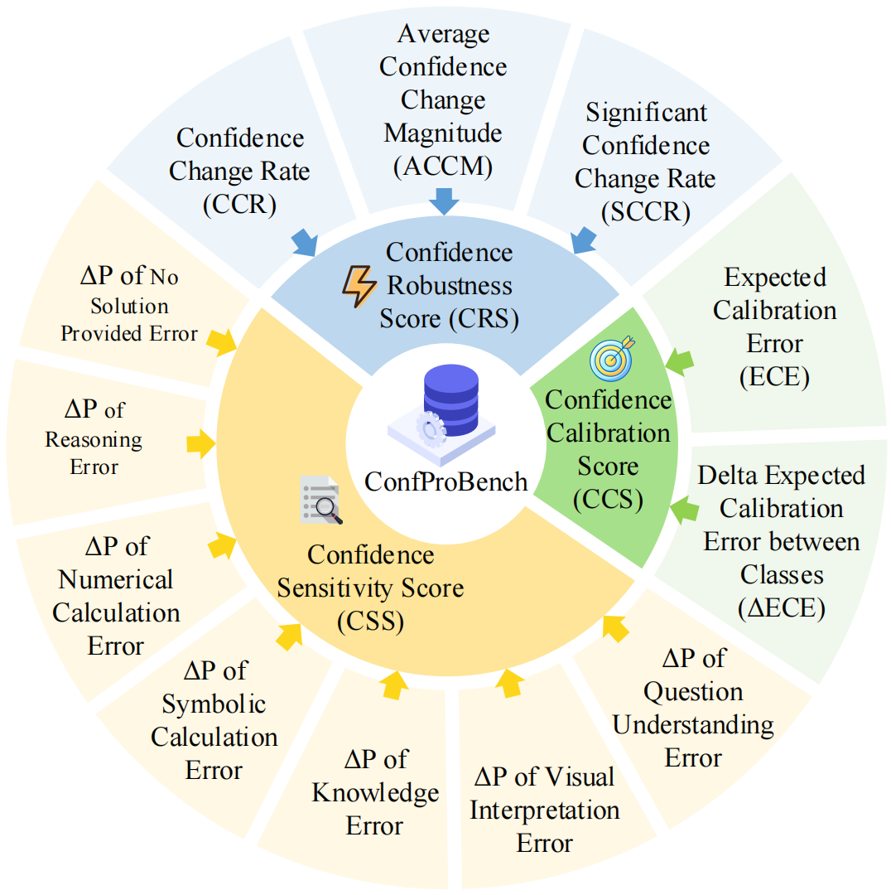

# ConfProBench: A Confidence Evaluation Benchmark for MLLM-Based Process Judges

<p align="center">
  📃 <a href="#">Paper</a> • 🤗 <a href="#">Dataset</a> • 🖥️ <a href="#">Code</a>
</p>

## 1. Updates
- **2025/08/07**: We released the first version of our [paper](https://arxiv.org/pdf/2508.04576). Code and dataset will be released soon.


## 2. Introduction

**ConfProBench** is the first comprehensive benchmark for evaluating the *step-level confidence reliability* of **Multimodal Large Language Model-based Process Judges (MPJs)**.

Reasoning is a core capability of MLLMs in complex multimodal tasks, and judging the correctness of each reasoning step is essential to improving this capability. MPJs have recently emerged as effective tools for reasoning step verification, yet current benchmarks largely focus on classification accuracy or search ability—while overlooking a critical dimension: **how reliable their confidence scores are**.

To address this gap, we introduce **ConfProBench**, a benchmark for systematically evaluating the reliability of step-level confidence scores from MPJs. Specifically:

- We construct three types of adversarially perturbed reasoning steps to evaluate the robustness of MPJs' confidence under perturbations:
  - 🔁 **Synonym Substitution**
  - 🔀 **Syntactic Transformation**
  - 🖼️ **Image Perturbation**

- We propose three novel evaluation metrics to analyze MPJs’ confidence behavior:
  - 🔒 **Confidence Robustness Score (CRS)**  
  - 🎯 **Confidence Sensitivity Score (CSS)**
  - ⚖️ **Confidence Calibration Score (CCS)**  

We evaluate **14 leading MLLMs**, including both proprietary and open-source models. Our results expose important limitations in existing MPJs and establish strong baseline performance for future research.


<p align="left">
  
</p>

<p align="left">
  <em>An overview of the data construction process for <strong>ConfProBench</strong>.</em>
</p>

<br/>

<p align="left">
  
</p>

<p align="left">
  <em>An overview of the proposed evaluation metric suite in <strong>ConfProBench</strong>.</em>
</p>


✒️Citation
---
Please cite our paper if you find our research and code useful.


<!-- ## 📄 Code License, Data License, and Usage Notice

The code and data in this repository are intended and licensed for **research use only**.

- **Code License**: [Apache License 2.0](https://www.apache.org/licenses/LICENSE-2.0)
- **Data License**: [Attribution-NonCommercial 4.0 International (CC BY-NC 4.0)](https://creativecommons.org/licenses/by-nc/4.0/) -->


<!-- ## 2. Load Data
> The data is provided in the `data/conf_test.parquet` file. -->


<!-- ## 3. Adversarial Perturbation Construction
- Run the script below to construct Synonym Substitution perturbations:
```bash
python synonym.py \
  --input_path data/conf_test.parquet \
  --output_dir outputs/synonym \
  --log_dir logs/synonym \
  --openai_api_key <api_key> \
  --openai_api_base <api_base_url> 
```

- Run the script below to construct Syntactic Transformation perturbations:
```bash
python structure.py \
  --input data/conf_test.parquet \
  --output outputs/structure \
  --log_dir logs/structure
  --api_key <api_key> \
  --api_base <api_base_url> 
```

- Run the script below to construct Image Perturbations:
```bash
python image_perturb.py \
  --input_path data/conf_test.parquet \
  --output_path outputs/image_perturbed.parquet \
  --image_key image_paths \
  --perturbed_dir_prefix perturbed_images
```

## 4. Evaluation
Run the script below to perform inference with ConfProBench using various models, generate their responses, and compute the evaluation metrics:
```bash
python evaluate.py \
  --adv True \
  --model_name gpt-4o \
  --model_name_loguse gpt-4o \
  --data_path data/conf_test.parquet \
  --max_tokens 5000 \
  --batch_size 100 \
  --num_workers 32 \
  --log_dir log_eval
```
Arguments:
- `--adv`: Whether to use adversarially perturbed samples. Accepts `"True"` or `"False"`.
- `--model_name`:Name of the model to be evaluated.
- `--model_name_loguse`:Model name used specifically for logging purposes (e.g., used in log file names if different from `--model_name`).
- `--data_path`:Path to the `.parquet` file containing the evaluation samples.
- `--max_tokens`:Maximum number of tokens allowed for model generation.
- `--batch_size`:Number of samples to process per batch.
- `--num_workers`:Number of parallel workers used during evaluation.
- `--log_dir`:Directory where evaluation logs will be saved. -->

